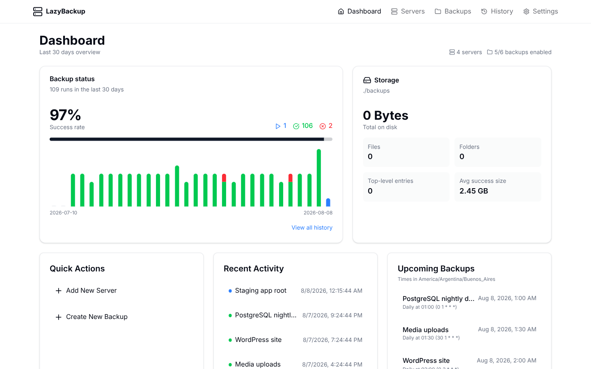
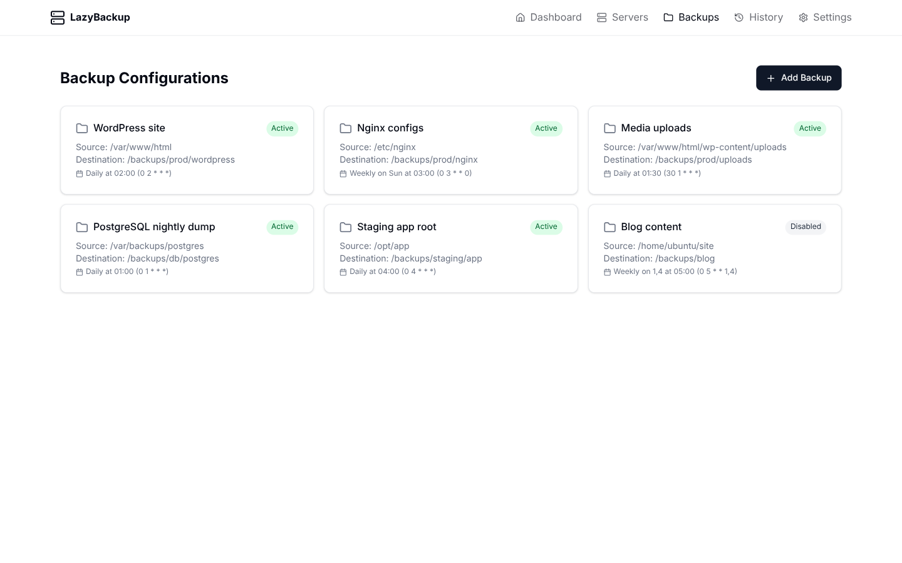
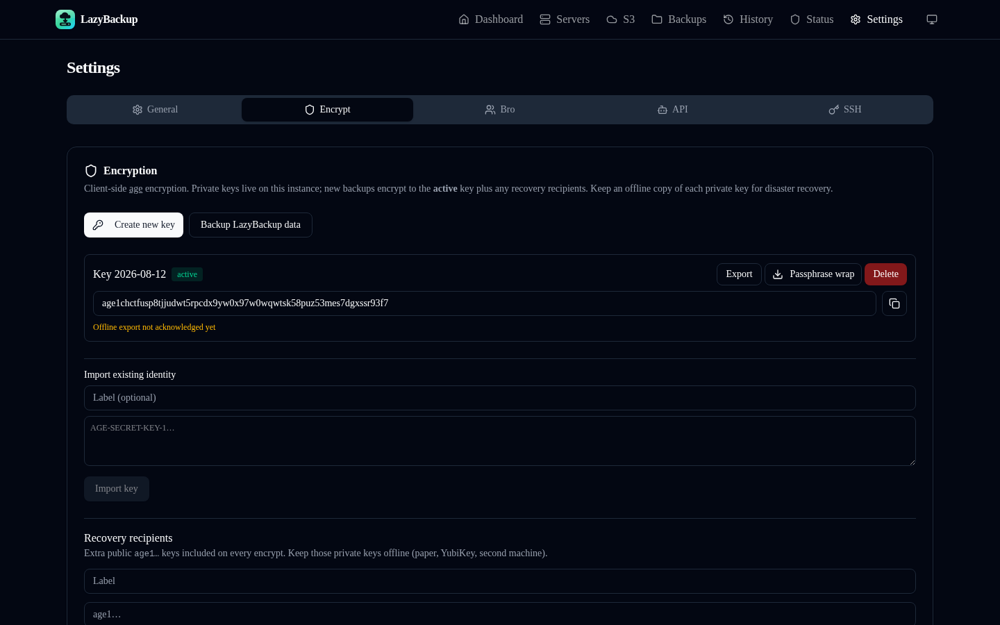

# LazyBackup — From → To backups

[](https://github.com/Ceneka/lazybackup/actions/workflows/ci.yml)
[](./LICENSE)
[](https://github.com/Ceneka/lazybackup/pkgs/container/lazybackup)
[](https://github.com/Ceneka/lazybackup/releases/latest)
[](https://github.com/Ceneka/lazybackup/stargazers)

**[lazy.zic.ar](https://lazy.zic.ar)** · **[GitHub](https://github.com/Ceneka/lazybackup)**

LazyBackup is a self-hosted web app for **From → To** backups between endpoints: **this host (local)**, any configured **Server**, **S3-compatible** storage, or a **Git** remote (source only). Connect over SSH, schedule jobs with cron, and transfer filesystem paths, Docker volumes, logical database dumps, or Git bare mirrors—including **server→server** (ephemeral direct or relay) and landings on S3.

**Why not just rsync/cron?** UI, schedules, retention, restore, and encryption without a pile of scripts — [lazy.zic.ar/compare](https://lazy.zic.ar/compare).







## Getting started

### Prerequisites

- [Bun](https://bun.sh) 1.0+ (or Node.js 18+)
- SSH access to your servers
- **SSH key authentication** on each server endpoint used in a backup transfer (rsync/scp run from the LazyBackup host and need a key). Password auth still works for **Test connection** and other `node-ssh` operations (list volumes/containers, etc.)
- `rsync`, `openssh-client`, and `git` on the host running LazyBackup (Git repository sources clone a bare mirror on this host)

### Docker (recommended)

```bash
docker run -d \
  --name lazybackup \
  --restart unless-stopped \
  -p 3000:3000 \
  -v lazybackup_data:/app/data \
  -v ./backups:/backups \
  -v ~/.ssh:/root/.ssh:ro \
  -e DATABASE_URL=file:/app/data/data.db \
  -e BACKUP_STORAGE_PATH=/backups \
  ghcr.io/ceneka/lazybackup:latest
```

The image is multi-arch (`linux/amd64` and `linux/arm64`).

Or with Docker Compose (pulls `ghcr.io/ceneka/lazybackup:latest`, persists the database volume). No `.env` is required — defaults are port 3000 and `./backups` on the host. Copy `.env.example` to `.env` only if you want to change `PORT`, `BACKUP_STORAGE_PATH`, or `SSH_KEYS_PATH`.

```bash
docker compose up -d
```

To build a local image instead of pulling GHCR:

```bash
docker compose -f docker-compose.yml -f docker-compose.dev.yml up --build
```

Open [http://localhost:3000](http://localhost:3000) (or `http://<lan-ip>:3000` on your network).

> **HTTP vs HTTPS:** On plain HTTP (typical LAN), leave `AUTH_COOKIE_SECURE` unset so the app password session cookie works. Set `AUTH_COOKIE_SECURE=true` only when the UI is served over HTTPS.

### Install catalogs

- **Unraid** — Community Applications XML: [`deploy/unraid/lazybackup.xml`](./deploy/unraid/lazybackup.xml) (`ghcr.io/ceneka/lazybackup:latest`, port 3000, data / backups / SSH mounts).
- **TrueNAS SCALE** — Compose: [`deploy/truenas/compose.yml`](./deploy/truenas/compose.yml) (same mounts as the root `docker-compose.yml`).
- **awesome-selfhosted** — ready-to-paste listing: [`deploy/awesome-selfhosted.md`](./deploy/awesome-selfhosted.md).

### Manual install

```bash
git clone https://github.com/Ceneka/lazybackup.git
cd lazybackup
cp .env.example .env   # optional
bun install
bun run db:migrate
bun run dev        # development
# bun run build && bun run start   # production
```

Set `DATABASE_URL` if you want a custom SQLite path (default: `file:./data.db`).

## Features

- **From → To** — Endpoints: this host, SSH servers, S3-compatible storage (MinIO, R2, B2, AWS, …), or Git remotes (source only)
- **Server → Server** — Ephemeral SSH key for direct rsync, or relay via the LazyBackup host when peers can’t reach each other
- **Server management** — Add, edit, and test VPS connections (password or SSH key auth)
- **Backup jobs** — Paths, Docker volumes, database dumps, or Git bare mirrors; cron schedules; exclude patterns; pre-backup shell commands
- **Docker volumes** — Discover named volumes on this host or a source server, pack as `.tar.gz` to a destination path/prefix, restore from History
- **Database dumps** — Postgres / MySQL / MariaDB → `.sql.gz` (native client or `docker exec`); SQLite → `.sqlite.gz` (native file copy / `.backup`); restore from History
- **S3 profiles** — Source prefixes and destination prefixes for path trees and archives
- **Git repositories** — Connections → Git; clone `--mirror` with a vault SSH key (or public HTTPS) and land `.tar.gz` anywhere
- **Versioned backups** — Optional timestamped snapshots with automatic count-based retention
- **File retention** — Optional age-based cleanup for dump-style destinations (keep a minimum number of files)
- **Automated scheduling** — In-process cron scheduler; set an app timezone so schedules run when you expect
- **History & dashboard** — Track runs, view logs, next run times, storage usage, and success rates
- **Path restore** — One-click restore of path trees from History (local / S3 / Bro artifacts) back to the source path, SSH host, or S3 prefix
- **Validate before run** — Probe SSH/S3/paths/DB without transferring (backup detail → Validate); last result is stored with a timestamp so you can see status without re-running
- **Failure webhooks** — Customizable HTTPS webhook on backup failure (method, headers, `{{tag}}` body/URL templates; Discord / Telegram / Kuma / ntfy / Slack presets)
- **Success pings** — Optional Healthchecks.io / Uptime Kuma-style GET (or POST) when a backup succeeds
- **Optional app password** — Single-operator lock (set on first run or later in Settings); session cookie lasts 30 days
- **MCP / API tokens** — Let Cursor, Claude, or other agents manage backups via Streamable HTTP MCP at `/mcp` (Settings → API / MCP)
- **Encryption** — Age vault (active / retired / compromised keys), recovery recipients, passphrase-wrapped export (Settings → Encryption); works with local, server, and S3 destinations
- **Instance backup** — Backup LazyBackup itself (SQLite + keys) as a schedulable job; optional archive passphrase
- **Passkeys** — WebAuthn login alongside or instead of the app password
- **Bro Space** — share encrypted backup space with a friend (Settings → Bro Space). Invite them to install **LazyBro**, or pair with another LazyBackup.

**Docs:** [Features](https://lazy.zic.ar/features) · [Compare](https://lazy.zic.ar/compare) · [Changelog](https://lazy.zic.ar/changelog) · [CONTRIBUTING](./CONTRIBUTING.md) · [SECURITY](./SECURITY.md) · [CHANGELOG](./CHANGELOG.md) · static site [`landing/`](./landing)

## Tech stack

- **Frontend:** Next.js 15, React 19, Tailwind CSS, shadcn/ui
- **Backend:** Next.js API routes
- **Database:** SQLite (libSQL) with Drizzle ORM
- **Transfer:** rsync (preferred) with scp fallback; S3 via AWS SDK
- **Runtime:** Bun

## Usage

1. **Optional password** — On first visit, set an app password or skip. Change or remove it later under Settings.
2. **Add a server** — Connections → Servers → add host, user, and SSH credentials. Use **Test connection** to verify rsync/scp (and Docker) availability. Prefer an SSH key for any server you will back up from or to.
3. **(Optional) S3 profile** — Connections → S3 → endpoint, bucket, and keys (path-style for MinIO/R2/B2 as needed).
4. **(Optional) Git repository** — Connections → Git → remote URL and an SSH key from Settings for private remotes. Backups clone a bare mirror on this host and store `.tar.gz` at the destination.
5. **Create a backup** — Backups → pick **From** and **To** (local, server, S3, or Git as source), then **filesystem path**, **Docker volume**, **database**, or **Git repository**. Default dest is still `/backups/<server>/<name>` on this host when To is local (Git sources default to `/backups/git/<repo>`). Optionally enable versioning and/or age-based file retention.
6. **Timezone** — Settings → choose the timezone used for cron schedules and “next run” times.
7. **Encryption (optional)** — Settings → Encryption → generate an age key (export and acknowledge a copy), optionally add recovery recipients, then enable “Encrypt before storing” on a backup (or use a Bro destination). Create new keys instead of overwriting; old keys stay for decrypt.
8. **Backup this instance** — Settings → Encryption → “Backup LazyBackup data”, or New Backup → local source → LazyBackup instance data. Restore is manual (replace DB / import keys).
9. **Passkeys (optional)** — Settings → Passkeys to register; use “Sign in with passkey” on `/login`.
10. **Bro Space (optional)** — Settings → Bro Space → save your address, create an invite, and send it to your friend. They install **[LazyBro](./bro/)** and paste the invite (or Accept below if they also run LazyBackup).
11. **Run or schedule** — Trigger a manual run or rely on the cron schedule. View results, logs, and storage under History and each backup’s detail page.
12. **Restore** — On a successful **path**, volume, database, or Git backup in History, restore back to the source (local path, SSH path, S3 prefix, named volume, DB, or a directory for the Git mirror), or onto a different host (History server picker). Artifacts on S3, Bro, or an SSH destination (key auth) are pulled onto this host first. Password-only SSH destinations cannot pull for restore. Download the artifact from History without restoring in place.

### LazyBro

See [`bro/README.md`](./bro/README.md). Your friend installs LazyBro, pastes your invite, picks a folder, and leaves it running. If they’re offline for a bit, that’s fine — backups still succeed and catch up later.

### Bro Space + Tailscale (CGNAT)

If friends can’t reach your LazyBackup from outside your network, Tailscale on **your** host is a common fix. LazyBackup does **not** ship Tailscale in the image (~50MB+). Use one of:

1. **Host Tailscale (keeps LAN `:3000`)** — install Tailscale on the machine, uncomment the `/var/run/tailscale` volume in `docker-compose.yml`, open Settings → Bro Space → **Use as LazyBackup address**.
2. **Compose overlay** — create an auth key, set `TS_AUTHKEY` in `.env`, then:

```bash
docker compose -f docker-compose.yml -f docker-compose.tailscale.yml up -d
```

   The app shares the Tailscale network namespace (`http://100.x.x.x:3000`). Host port publish is disabled in that mode.

### MCP (agent access)

Connect Cursor, Claude, VS Code, or other MCP clients to this instance:

1. Enable an **app password** (recommended) under Settings.
2. Open **Settings → API / MCP**, create a token, and copy it immediately (shown once).
3. Use **Add to Cursor** / **Add to VS Code**, or copy `mcp.json` / Claude config / Claude Code CLI.

Example `mcp.json` (replace host and token):

```json
{
  "mcpServers": {
    "lazybackup": {
      "url": "https://your-host/mcp",
      "headers": {
        "Authorization": "Bearer lb_…"
      }
    }
  }
}
```

Tokens can manage backups and servers. **Remote shell** (`exec_command` / `POST /api/servers/:id/exec`) and **setting or changing pre-backup commands** require the opt-in **Allow remote command execution** permission when creating the token (browser sessions always have it). Prefer HTTPS or a trusted LAN. Revoke tokens anytime from the same Settings tab. Destructive MCP tools (`delete_*`, `restore_history`, `exec_command`) require `confirm: true`.

### Failure notifications

Under **Settings → General**, configure a failure webhook:

- **Method** — `GET`, `POST`, or `PUT`
- **URL / headers / body** — support `{{tags}}` (`{{event}}`, `{{backupName}}`, `{{configId}}`, `{{historyId}}`, `{{errorMessage}}`, `{{endedAt}}`)
- **Presets** — Default JSON, Discord, Telegram, Uptime Kuma (push), ntfy, Slack

Empty body (POST/PUT) sends the built-in JSON:

```json
{
  "event": "backup.failed",
  "backupName": "Daily DB",
  "configId": "…",
  "historyId": "…",
  "errorMessage": "…",
  "endedAt": "2026-08-10T12:00:00.000Z"
}
```

HTTPS is required (`http://` only for localhost/LAN). Empty URL disables notifications. Use **Send test notification** to verify.

### Success pings

Also under **Settings → General**, optionally configure a **success ping** (Healthchecks.io / Uptime Kuma style):

- Defaults to **GET** (paste your check’s ping URL)
- Same URL rules and optional `{{tags}}` (`{{event}}`, `{{backupName}}`, `{{configId}}`, `{{historyId}}`, `{{endedAt}}`)
- Presets — Healthchecks.io, Uptime Kuma (up), Default JSON (POST)
- Empty URL disables pings; failures never fail the backup (fire-and-forget)
- Use **Send test ping** to verify

POST/PUT with an empty body sends `{"event":"backup.succeeded",…}`.

### Secrets in the API

`GET` responses for servers, S3 profiles, and backups **never include** passwords, SSH private keys, S3 secret keys, or DB passwords. Flags such as `hasPassword` / `hasPrivateKey` / `hasSecretAccessKey` / `hasDbPassword` tell the UI a secret is stored. On edit, leave those fields blank to keep the existing value.

### Docker volume notes

- Volume sources are a **source server** (SSH) **or this host** (optional `/var/run/docker.sock` mount — that is root-equivalent on the daemon).
- The Docker user needs permission to run `docker` (typically membership in the `docker` group, or the socket mount).
- Packing uses a temporary `alpine` helper container; the host must be able to pull/run that image.
- Live database volumes can be inconsistent if written during backup — prefer the **database** source type for logical dumps, or stop the service first via pre-backup commands when you need a consistent filesystem snapshot.

### Environment variables

| Variable | Default | Description |
|----------|---------|-------------|
| `DATABASE_URL` | `file:./data.db` | SQLite database location (`file:/app/data/data.db` in Docker) |
| `PORT` | `3000` | HTTP port |
| `BACKUP_STORAGE_PATH` | `./backups` | Host directory for backup files (Compose mounts this at `/backups` and `/app/backups`) |
| `SSH_KEYS_PATH` | `~/.ssh` | System SSH keys (Docker mount, read-only) |
| `AUTH_SECRET` | (auto in settings) | HMAC secret for session cookies; auto-generated in SQLite if unset |
| `AUTH_COOKIE_SECURE` | unset (`false`) | Set `true` only behind HTTPS; Secure cookies are dropped on plain HTTP |
| `ENABLE_HSTS` | unset (`false`) | Set `true` only when every request is HTTPS; prefer HSTS on the reverse proxy. Leave unset for HTTP/LAN. |
| `AUTH_TRUST_PROXY` | unset (`false`) | Trust `X-Forwarded-Host` / `X-Forwarded-Proto` / `X-Forwarded-For` for WebAuthn RP ID and login backoff. Set `true` only behind a reverse proxy that overwrites these headers. |
| `AUTH_PUBLIC_URL` | unset | Public origin for WebAuthn (overrides Host / forwarded headers), e.g. `https://backup.example.com` |
| `ALLOW_ARBITRARY_LOCAL_PATHS` | unset (`false`) | Allow local backup destinations outside `BACKUP_STORAGE_PATH`. Default denies paths outside the storage root. |
| `ALLOW_PRIVATE_S3_ENDPOINTS` | unset (`false`) | Allow S3-compatible endpoints on loopback/private IPs (LAN MinIO). Default denies loopback, RFC1918, link-local, and cloud metadata addresses. |
| `ALLOW_PRIVATE_PEER_URLS` | unset (`false`) | Allow Bro Space pairing/sync to RFC1918 and loopback URLs. Default allows public http(s) and Tailscale only. IMDS/link-local are always blocked. |
| `ALLOW_LAN_WEBHOOKS` | unset (`true`) | Allow HTTP webhooks/pings to localhost and RFC1918 (LAN ntfy/Kuma). IMDS/link-local are always blocked. Set `false` for public HTTPS only. |

See [`.env.example`](./.env.example) for a copy-paste template.

## Development

```bash
bun run dev         # Start dev server
bun run lint        # ESLint
bun test            # Unit tests on the host
bun run test:docker # Alpine unit tests + production image smoke (musl / GHCR parity)
```

`test:docker` builds the Alpine image, runs `bun test` inside it, then starts the production image and hits `/api/health` (migrations + `@libsql` natives). Use this when changing Docker/native deps so host `bun run dev` success doesn’t hide Alpine failures.

See [AGENTS.md](./AGENTS.md) for architecture details aimed at contributors and AI agents.

## License

MIT — see [LICENSE](./LICENSE). Anyone may use, modify, and redistribute LazyBackup.

[Contributing](./CONTRIBUTING.md) · [Security](./SECURITY.md) · [Changelog](./CHANGELOG.md)

## Acknowledgements

- [Next.js](https://nextjs.org/)
- [Drizzle ORM](https://orm.drizzle.team/)
- [Tailwind CSS](https://tailwindcss.com/)
- [shadcn/ui](https://ui.shadcn.com/)
